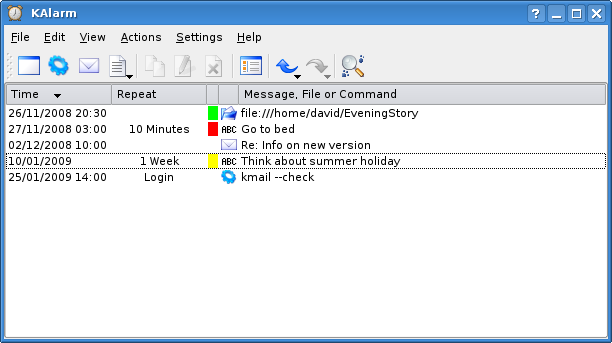

# [ClockAlarm](https://github.com/BFH-BTI7301-project1/ClockAlarm)

   

## Projet Vision

The goal of this project is to develop a replacement for the
program „kAlarm“ distributed with the KDE desktop
environment.

The program kAlarm allows the user to define some events
(possibly recurrent) and display alarms using pop-up windows
on the screen at times defined by the event. The project should
develop an alternative to this tool, which is platform
independent and open-source.

**Must have goals:** recurrent events, persistence, event
categories, external configuration file, database independent,
operating system independent

**Nice to have goals:** Sub-repetition of events, starting commands
at event time, internationalization, user can change fonts and
colours of the pop-up windows, iCalendar import.

# Useful links
* Complete Python guide (including best practises for structuring a project, code styling PEP8, writing documentation, etc.): [The Hitchhiker’s Guide to Python](http://docs.python-guide.org/en/latest/)
* Everything about latex: [Latex wikibook](https://en.wikibooks.org/wiki/LaTeX)
* [Beginner's Guide to Python](https://wiki.python.org/moin/BeginnersGuide)
* [Python for Java Programmers](http://python4java.necaiseweb.org/Main/TableOfContents)
* [Python for the busy Java Developer](https://antrix.net/static/pages/python-for-java/online/)