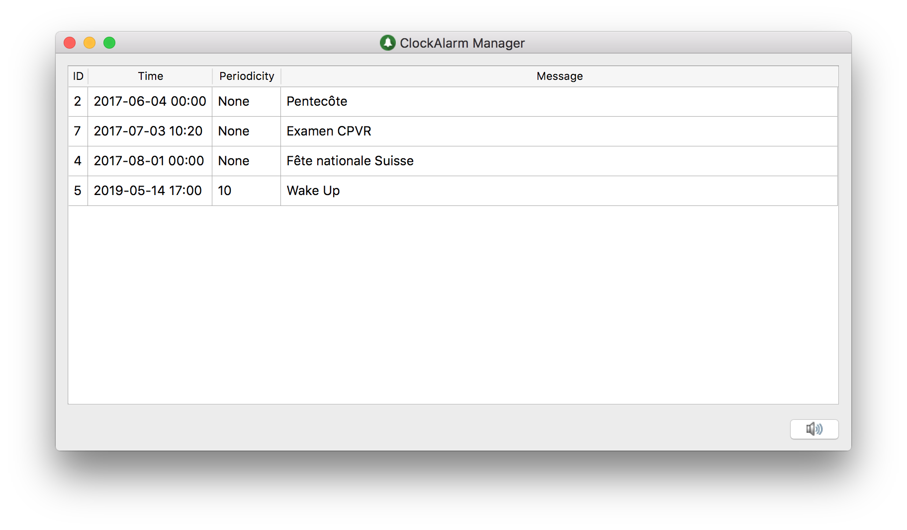

# [ClockAlarm](https://github.com/BFH-BTI7301-project1/ClockAlarm)

[](http://www.gnu.org/licenses/gpl-3.0) [](http://clockalarm.readthedocs.io/en/latest/?badge=latest) [](https://travis-ci.org/BFH-BTI7301-project1/ClockAlarm) [](https://coveralls.io/github/BFH-BTI7301-project1/ClockAlarm?branch=master)



ClockAlarm is a cross-platform (linux, Windows, macOS) alarm manager.

## Content

* [Installation](#installation)
	* [Requirements](#requirements)
* [Usage](#usage)
* [Development](#development)
* [Documentation](#documentation)
* [Bugs](#bugs)


## Installation 

### Requirements

* python => 3.6
* pygame => 1.9.3
* PyQt5 => 5.8.2
* sip => 4.19.2
* tinydb => 3.2.2

```bash
> pip3 install pygame pyqt5 sip tinydb
```

```bash
> git clone https://github.com/BFH-BTI7301-project1/ClockAlarm.git
```

## Usage

```bash
> python3 bin/clockalarm

```

## Development

To develop ClockAlarm and run the tests the following packages are necessary:

* coverage >= 4.4.1
* pytest >= 3.0.7
* pytest-cov >= 2.5.1
* pytest-qt >= 2.1.0
* pytest-catchlog >= 1.2.2
* coveralls >= 1.1

Run the following command:

```bash
> pip3 install coverage pytest pytest-cov pytest-qt pytest-catchlog coveralls
```

Run the tests:

```bash
> py.test --cov-report term --cov=. _clockalarm/_tests
```

## Documentation

The documentation can either be found under ```docs/pdf/clockalarm_documentation.pdf``` or [clockalarm.readthedocs.io](https://clockalarm.readthedocs.io)

You can also compile it yourself. Make sure that Sphinx (>= 1.6.1) is installed. The simply run ```make html``` in the ```/docs```directory.

## Bugs

Please open a new github issue if you encounter any bugs.